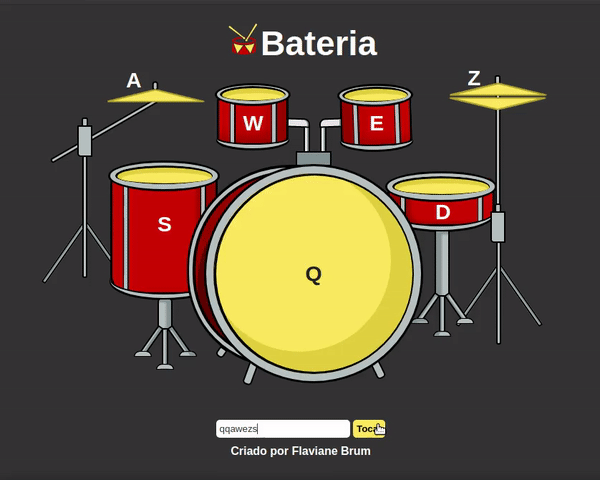
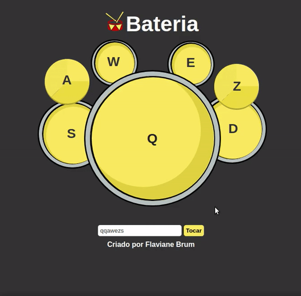

<h1 align="center">
 

 
Projeto Bateria
<h2>:pencil: Sobre o projeto</h2>

 Esse projeto foi feito para treinar CSS3, Javascript e HTML5.

 

  <h2>:camera_flash: Screenshots das telas</h2>
  <h3  align="left">:drum: Desktop</h3>
  
    
  <h3 align="left" >:drum: Mobile</h3>
  
 

Você pode conferir o resultado final em: 
<a href="https://flaviane-brum.github.io/Projeto-Bateria/"> https://flaviane-brum.github.io/Projeto-Bateria/
</a>

<h2> 🛠 Tecnologias </h2>
As seguintes ferramentas foram usadas na construção do projeto:

- HTML5
- CSS3
- Javascript

Made with :hearts: by Flaviane Brum.
